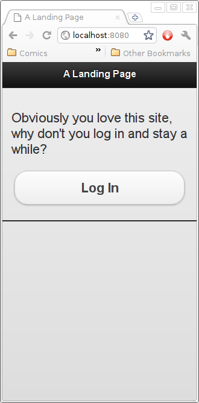
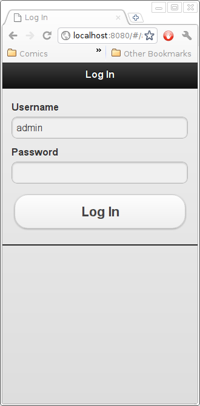
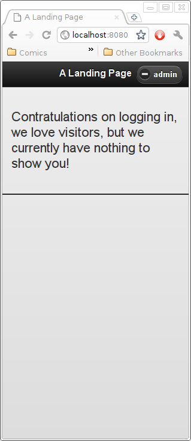
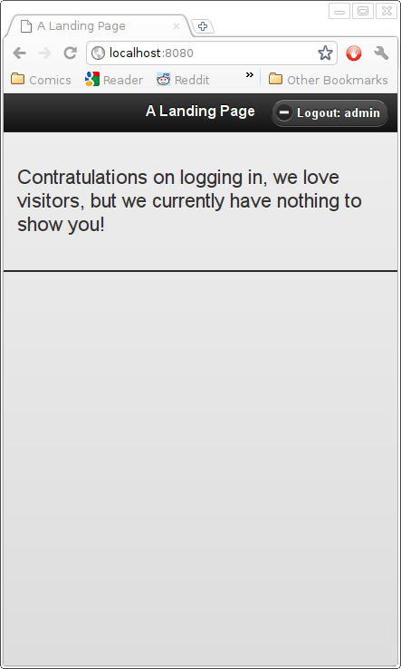

Basic View (with Login/Logout)
==============================

We have now completed our project setup, the next step is to actually use JQuery Mobile to create some views.  The jqm project simply provides a number of templates that can be used to quickly get your jqm site up and running with the content-distribution-network hosted jqm sources.  These templates are fairly basic in their design, they use the default jqm styles to produce a generic layout.

We'll set up the DB so that Django will start up::

    $ DJANGO_SETTINGS_MODULE=tutorial.settings django-admin.py syncdb
    $ DJANGO_SETTINGS_MODULE=tutorial.settings django-admin.py runserver 0:8080

URL Configuration and Login/Logout Support
------------------------------------------

Our first view will be a fairly generic landing page with a bit of text and a "call to arms" in the form of a button to view a login-protected page (since we only have a single page at the moment, this will currently be our front-page as well).  Since we need the page to show up as the root page, we'll add a reference to the project urls.py.  We'll also enable a login and logout page with a url mapping::

    from django.conf.urls.defaults import patterns, include, url
    urlpatterns = patterns('',
        # Examples:
        url(r'^/?$', 'tutorial.views.home', name='home'),
        
        url(
            r'^accounts/login/$','django.contrib.auth.views.login',
            dict(   
                template_name = 'jqm/login.html',
            ),
            name='login',
        ),
        url(
            r'^accounts/logout/$','django.contrib.auth.views.logout',
            dict(
                template_name = 'jqm/logout.html',
            ),
            name='logout', 
        ),
        
    )

Pay particular attention to the names used, the `django-jqm` templates use named url references for generating login/logout buttons and the like.  The actual views used are the built-in login/logout views from the django `auth` framework.

A Generic View (for Now)
------------------------
    
And then we will add the home view to our views module (we could, instead, use a generic view here, but you are likely going to want to customize this view later)::

    from django.shortcuts import render_to_response
    from django.template import RequestContext as RC

    def home( request ):
        return render_to_response(
            'index.html',
            {},
            context_instance = RC( request, {} ),
        )

A JQM-derived Template
----------------------
        
And create the templates folder for our project templates::

    $ mkdir tutorial/templates

our view is currently just rendering the template `index.html` which extends the `jqm/simple.html` base template::

    
    A Landing Page
    
    
        
Obviously you love this site, why don't you log in and stay a while?

        <a data-role="button" href="">Log In</a>
    
        
Contratulations on logging in, we love visitors, but we currently have nothing to show you!

    
    

The Results
-----------
    
At this point, we can run our development server::

    $ DJANGO_SETTINGS_MODULE=tutorial.settings django-admin.py runserver 0:8080

and check out the web-site at::

    http://localhost:8080/

where we can see this (approximately):

You will note that the page transition from the call to arms page and the initial login page is a "slide" animation (the default for JQuery Mobile), while the transition on submitting from the login page is a regular web-page reload.  This is because the login page, as with most form-handling pages, uses a redirct-on-success operation.  JQuery Mobile currently does not have a way to handle a redirected form properly, so our login template tells the login form to use regular page-loading rather than a JQuery Mobile brokered AJAX submission of the form content.

You will also note that the logout button shows/hides the "Logout:" text as the window is wider/narrower.  This is done with a `CSS Media Query`_.  You will need to understand those to be able to customize your mobile web-apps.

.. _`CSS Media Query`: http://www.w3.org/TR/css3-mediaqueries/

You may want to continue on to :doc:form5.
