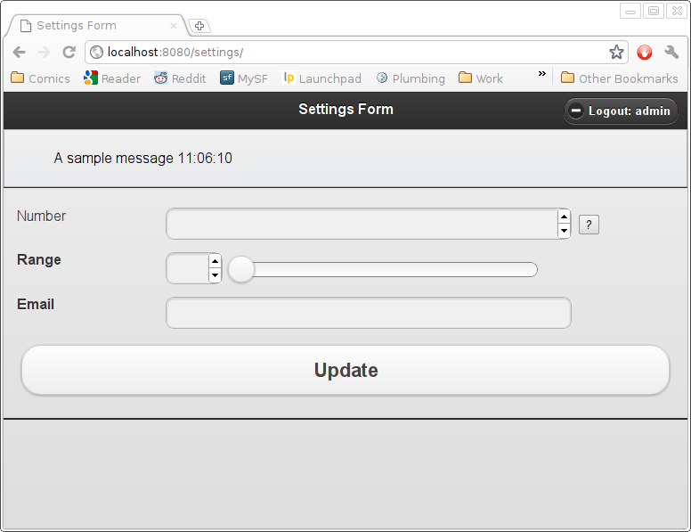
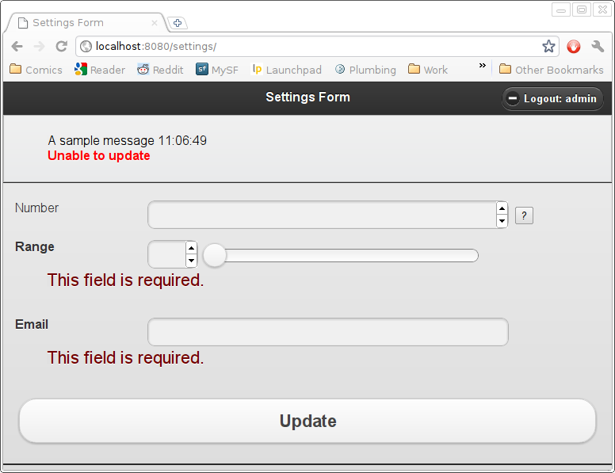

An (HTML5) Form View
====================

JQuery Mobile allows you to wrap a "regular" web site into a mobile web-site quickly.  Once you have the site "mobile" you can begin to tweak and enhance it, but the first steps should be as fast as possible.  This part of the tutorial will show you how to use (HTML5) forms with JQuery Mobile.  There's no requirement to use HTML5 with your forms, but many mobile web-browsers will automatically customise their input mechanisms with specialised keyboards when you do; that makes it much easier for users to enter data on a mobile platform.

This will be a fairly short tutorial; the point of the technology is to make the process simple.  The `jqm/form.html` template is a short Django template which extends the `jqm/simple.html` template to allow for creating "just a form" templates very quickly from your existing forms.

You will likely want custom form-handling for your real applications, see the `jqm/templates` directory for the code to the `jqm/form.html` template.

HTML5 Forms
-----------

The `django-html5`_ project provides support for using HTML5 widgets on a per-form basis.  To install the module (if you didn't during :doc:`setup`::

    $ pip install -e "git+https://github.com/rhec/django-html5.git#egg=django-html5"

once you have the module, you can customise your Django forms with `html5.forms.widgets` instances assigned to the `widget` parameter of your form fields.  The only special case currently is for `IntegerField`, where you can use the `html5.forms.fields.IntegerField` class to provide min/max pass-through::

    from django.utils.translation import ugettext_lazy as _
    from django import forms 
    from html5.forms import fields as five_fields,widgets as five_widgets
    
    class SampleForm( forms.Form ):
        """Sample form with HTML widgets"""
        number = five_fields.IntegerField( 
            required = False,
            min_value = 0,
            max_value = 25,
            help_text = _('Some helpful text' ),
        )
        range = forms.IntegerField(
            widget = five_widgets.RangeInput(
                attrs = dict(
                    min = '0',
                    max = '10',
                ),
            )
        )
        email = forms.CharField(
            widget = five_widgets.EmailInput(
            ),
        )

.. _`django-html5`: https://github.com/rhec/django-html5
        
Creating the View
-----------------

We'll create a view that pretends to allow the user to control their settings (actually controlling settings is just regular Django, and left to the reader).  First we will register our new URL in `urls.py`::

    url(r'^/?$', 'tutorial.views.settings', name='settings'),

and a corresponding view function in our `views.py` module::

    from django.http import HttpResponse,HttpResponseRedirect
    from django.contrib.auth.decorators import login_required
    from django.contrib import messages
    import time

    @login_required
    def settings( request ):
        messages.info( request, _('A sample message %s')%(time.strftime('%H:%m:%S')) )
        if request.method == 'GET':
            form = SampleForm()
        else:
            form = SampleForm( request.POST )
            if not form.is_valid():
                messages.error( request, _("Unable to update"))
            else:
                messages.success( request, _("Updated"))
                return HttpResponseRedirect(
                    reverse( 'home' )
                )
        return render_to_response(
            "jqm/form.html",
            {
                'title': 'Settings Form',
                'form': form,
            },
            context_instance = RC( request ),
        )

    from django.utils.translation import ugettext as _

The `jqm/form.html` template substitutes in our title and renders the form as the body of the page.  It uses non-AJAX post to work around the JQuery Mobile redirect limitations.  The Django `messages` framework is also used; it is rendered in the `jqm/simple.html` template as part of the page "header" (the bar at the top of the page).

Results
-------

When rendered on most mobile browsers (and most modern desktop browsers), your HTML5 inputs should have enhancements including customised input, basic data-validation and the like.  The `jqm/form.html` template will render an unstyled "help" button for those fields which have help-text defined.  Clicking the button will cause the help text to be displayed (again, in an unstyled manner).

What's with the Translations?
-----------------------------

You may have noticed the strange pattern of importing _ at the top of the module and then again at the bottom of the module.  This allows your definition-time (i.e. import-time) references to gettext (the translation entry point) to be to the lazy version, while your run-time references are to the non-lazy version without any special machinery required to have gettext find both.
